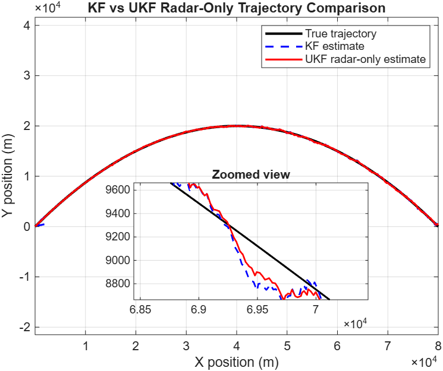
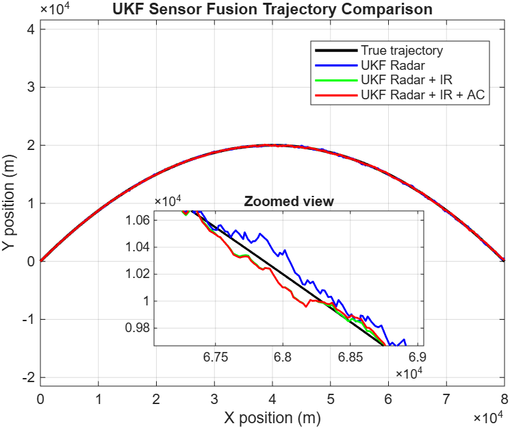

# Multi-Sensor Fusion for Ground-Based Ballistic Missile Tracking Using Kalman-Based Filters

Multi-sensor fusion for ground-based ballistic missile tracking using Kalman and Unscented Kalman Filters, with radar, infrared (IR) and acoustic (AC) sensor fusion implemented in MATLAB/Simulink.

## Overview

This project investigates sensor fusion techniques for tracking a ballistic missile trajectory using simulated radar, infrared (IR) and acoustic (AC) measurements. A standard Kalman Filter (KF) and Unscented Kalman Filter (UKF) were implemented and compared to evaluate the effect of nonlinear measurement processing and additional sensor information on tracking accuracy.

A two-dimensional MATLAB/Simulink model was developed with the three sensors operating at different sampling rates and noise levels. The filter performance was assessed using Root Mean Squared Error (RMSE), 50 Monte Carlo simulations and Normalised Innovation Squared (NIS).

The main research question was whether multi-sensor UKF fusion improves tracking accuracy over the standard KF and how much each additional sensor contributes.

## Objectives

- Compare KF and UKF tracking performance using radar measurements.
- Investigate the effect of adding IR and acoustic measurements to the UKF.
- Evaluate tracking accuracy using RMSE.
- Assess performance across different noise conditions using Monte Carlo simulation.
- Evaluate filter consistency using NIS.
- Investigate whether adding more sensors necessarily improves tracking performance.

## System Model

The simulation produced a known two-dimensional ballistic trajectory starting at the origin, reaching a maximum altitude of 20 km and travelling to a range of 80 km.

The trajectory was simulated for 180 seconds with a time step of 0.05 seconds, providing 3601 samples.

The three sensors were modelled at the origin and generated noisy measurements from the true trajectory.

### Sensor models

| Sensor | Measurements | Noise | Sampling time |
|---|---|---:|---:|
| Radar | Range + bearing | 10 m, 0.5° | 0.05 s |
| Infrared | Bearing | 0.3° | 0.10 s |
| Acoustic | Bearing | 2.0° | 0.20 s |

The different sampling rates were implemented using a sample-and-hold approach, where the slower sensor measurements were retained between updates.

## Filter Implementation

Four configurations were tested:

1. **KF Radar-only**
2. **UKF Radar-only**
3. **UKF Radar + IR**
4. **UKF Radar + IR + AC**

The standard Kalman Filter requires a linear measurement model. Since radar provides nonlinear range and bearing measurements, the radar measurements were converted from polar to Cartesian coordinates before being passed to the KF.

The UKF avoids this conversion by processing the nonlinear measurement functions directly using sigma point propagation.

This provided a comparison between the standard KF approach and nonlinear measurement processing using the UKF.

## Sensor Fusion Architecture

The UKF configurations combined measurements from the available sensors into a single measurement vector.

The measurement noise covariance matrix was expanded according to the number of sensors:

- Radar-only: 2 × 2
- Radar + IR: 3 × 3
- Radar + IR + AC: 4 × 4

The UKF updated at the radar sampling rate, while the slower IR and acoustic measurements were held at their most recent values between updates.

## Validation Methodology

The filters were evaluated using RMSE, Monte Carlo simulation and NIS.

### RMSE

RMSE was used to measure the position error between the estimated and true missile trajectory.

The Monte Carlo analysis was run for **50 trials**, with different random noise conditions applied to the sensor measurements.

| Method | Mean RMSE | Std. deviation | % of Range | Vs KF |
|---|---:|---:|---:|---:|
| KF Radar | 132.37 m | 4.81 m | 0.17% | — |
| UKF Radar | 90.77 m | 6.08 m | 0.11% | 31.4% |
| UKF Radar + IR | **60.69 m** | 3.52 m | 0.08% | **54.2%** |
| UKF Radar + IR + AC | 61.03 m | 3.41 m | 0.08% | 53.9% |

### NIS

Normalised Innovation Squared (NIS) was used to evaluate the consistency of the UKF uncertainty estimates.

| UKF Configuration | Expected Mean NIS | Mean NIS | Samples Within 95% Bounds |
|---|---:|---:|---:|
| Radar-only | 2 | 1.489 | 95.66% |
| Radar + IR | 3 | 2.477 | 95.30% |
| Radar + IR + AC | 4 | 3.491 | 95.15% |

The high percentage of samples within the 95% bounds indicates consistent innovation behaviour across the three UKF configurations.

## Results

### Trajectory Tracking

The estimated trajectories were compared against the true ballistic trajectory to assess the behaviour of the filters.



Both filters followed the overall ballistic arc, but the UKF produced a better estimate and followed the true path more closely than the KF.

This reflects how the filters handle the radar's polar measurements. The KF requires the measurements to be converted to Cartesian coordinates before filtering, while the UKF processes the nonlinear measurements directly using sigma point propagation.



The radar-IR and full-fusion estimates showed similar performance, while the radar-only UKF exhibited greater inaccuracy.

### Key Findings

- The radar-only UKF achieved a **31.4% lower RMSE** than the KF using the same radar measurements.
- Adding IR to the radar-only UKF reduced RMSE from **90.77 m to 60.69 m**, a further **33.1% reduction**.
- Radar + IR achieved the best overall tracking performance.
- Adding the acoustic sensor did not provide a further accuracy improvement, with RMSE increasing slightly from **60.69 m to 61.03 m**.
- The results show that the benefit of sensor fusion depends on the quality of the additional sensor information rather than simply the number of sensors.
- The standard deviations of approximately 3–6 m across the configurations indicate consistent performance under the different noise conditions tested.
- NIS results showed that between **95.15% and 95.66%** of samples remained within the 95% bounds.

## Discussion

The results demonstrate the benefit of nonlinear measurement processing for this tracking problem. The UKF outperformed the standard KF when using identical radar measurements, with a 31.4% reduction in RMSE.

The addition of IR provided a further improvement, reducing the UKF radar-only RMSE by 33.1%. However, adding the acoustic sensor to the radar-IR configuration produced no further improvement.

This suggests that additional sensors do not necessarily improve tracking performance. The quality of the measurement and the information it provides within the operational range are more important than simply increasing the number of sensors.

In this simulation, the acoustic sensor had a relatively high bearing noise of 2.0°. At distances greater than 40 km, this can produce significant lateral uncertainty, limiting the benefit of the acoustic measurements when radar and IR are already available.

## Limitations

The results should be interpreted within the limitations of the simulation.

The trajectory was two-dimensional and did not model lateral motion or target manoeuvres. The sensor models also assumed Gaussian noise and known ground truth, whereas real tracking environments can introduce radar clutter, environmental effects that reduce IR performance and atmospheric disturbances.

The sample-and-hold fusion architecture provided a practical multi-rate implementation, but it did not perform fully asynchronous sensor updates.

Therefore, the results represent filter performance under controlled simulation conditions. Further validation using real sensor data and more representative target trajectories would be required to assess performance in realistic tracking environments.

## Future Work

Future work could include:

- Extending the model to three-dimensional trajectories.
- Introducing target manoeuvres.
- Testing the filters using real sensor data.
- Implementing asynchronous sensor updates.
- Investigating alternative methods for combining sensors with different sampling rates.
- Comparing the UKF with other nonlinear filters such as Particle Filters and Fuzzy Filters.

## Technologies

- MATLAB
- Simulink
- Kalman Filtering
- Unscented Kalman Filtering
- Sensor Fusion
- Monte Carlo Simulation
- RMSE Analysis
- NIS Analysis

## Project Structure

```text
├── Simulink/
│   └── new_fusion_model.slx
│
├── MATLAB/
│   ├── Initialisation/
│   │   ├── initKF.m
│   │   ├── initUKF.m
│   │   └── initNoise.m
│   │
│   └── UKF_Functions/
│       ├── ukf_state_transition_2026.m
│       ├── ukf_radar_range_2026.m
│       ├── ukf_radar_bearing_2026.m
│       ├── ukf_ir_bearing_2026.m
│       └── ukf_ac_bearing_2026.m
│
├── Analysis/
│   ├── New_RSME.mlx
│   └── NIS.mlx
│
└── Results/
    ├── KF_traj_new.png
    ├── UKF_traj_new.png
    ├── RMSE_results.png
    └── NIS_results.png
